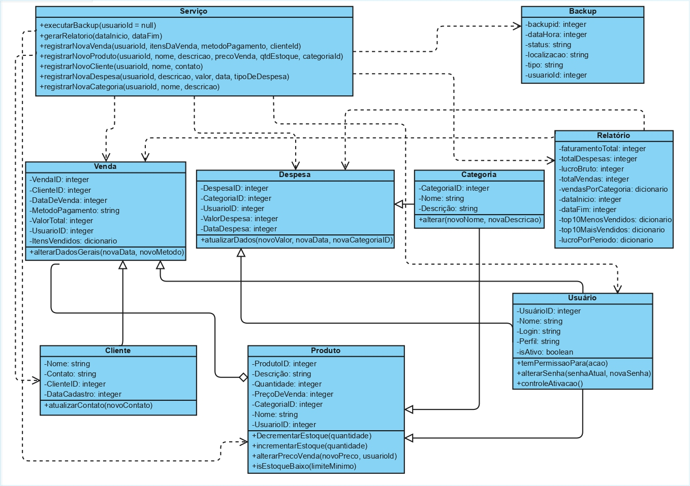

SOBRE O SISTEMA 

Este projeto é um sistema de gestão desenvolvido durante o 2º período da graduação em Sistemas de Informação. A aplicação, desenvolvida em Python, foi planejada para ser modular e escalável, com o intuito de auxiliar na tomada de decisão no âmbito administrativo de pequenas lojas.

METODOLOGIA

Foi realizada uma pesquisa de campo em lojas do centro de Caruaru para identificar estabelecimentos que enfrentavam dificuldades devido à falta de um sistema de gestão. Por meio de entrevistas, foi elaborado um diagrama de classes para análise de viabilidade e planejamento do sistema. O sistema foi estruturado de forma modular, com cada classe implementada em um arquivo separado, funcionando como um CRUD, e todos interconectados por um arquivo principal (`Main.py`). Os dados são armazenados em arquivos CSV, visando facilitar a futura integração com softwares como Excel e Power BI, ferramentas já utilizadas pela lojas entrevistada.

DIAGRAMA DE CLASSE

FUNCIONALIDADES
- Gestão de Produtos (implementado) - Cadastro e consulta de produtos, com catálogo informando preço, quantidade, produtos mais e menos vendidos, função de busca, etc.

- Registro de Vendas (em desenvolvimento) - Registro de vendas de produtos, incluindo método de pagamento, data, cliente etc.

- Cadastro de Clientes (em desenvolvimento) - Base de dados de clientes com histórico de compras individual.

- Controle Financeiro (em desenvolvimento) - Registro de despesas e cálculo de lucros.

- Sistema de Relatórios (em desenvolvimento) - Análise de vendas e geração de dados em CSV para futura elaboração de dashboards e relatórios no Power BI.

- Backup de Dados (em desenvolvimento) - Backup em nuvem dos arquivos Csv.

TECNOLOGIAS UTILIZADAS
- Python 3
- Módulo nativo 'csv'
- Git e GitHub

COMO EXECUTAR
- Clone o repositório: git clone https://github.com/yan-dhsk/Sistema-De-Gestao-CSV.git

- Navegue até o diretório do projeto: cd Sistema-De-Gestao-CSV

- Execute o script principal: python Main.py

- Siga as instruções do menu para interagir com o módulo de produtos.

COLABORADORES
- [Yan Neves](https://github.com/yan-dhsk)
- [Vinicius Meneses](https://github.com/viniciusmeneses-maker)
